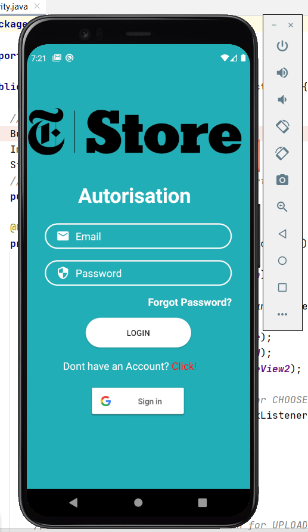
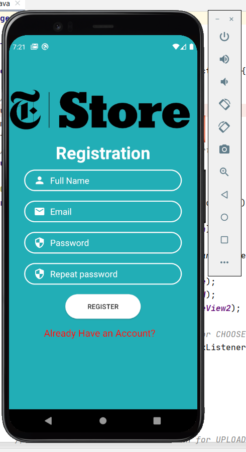
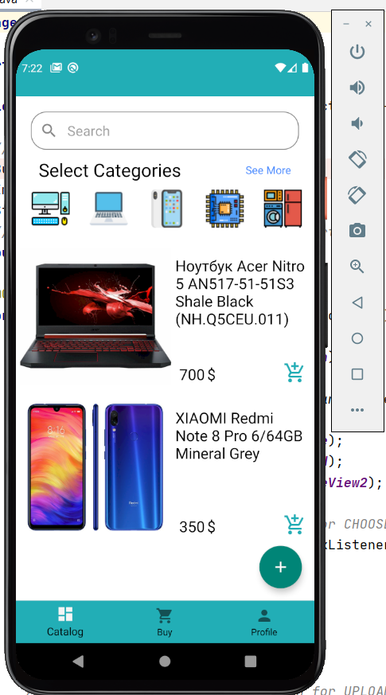
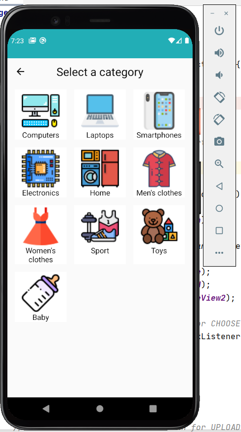
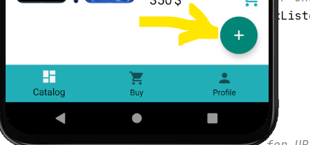
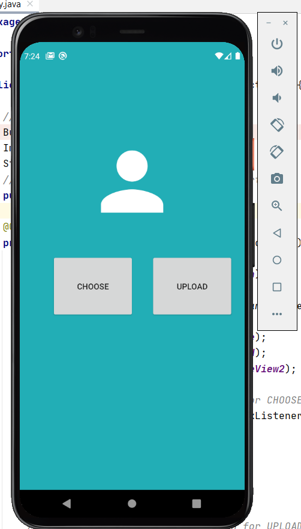
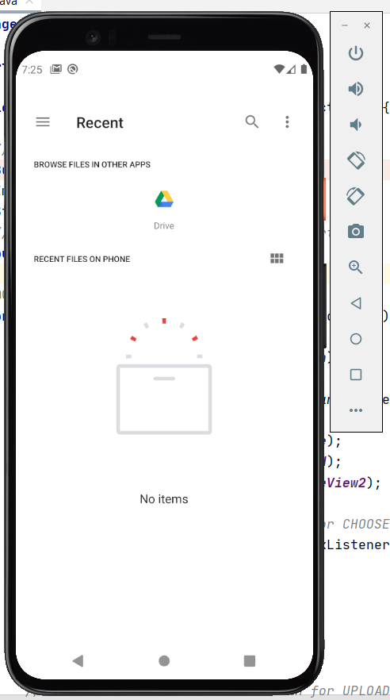
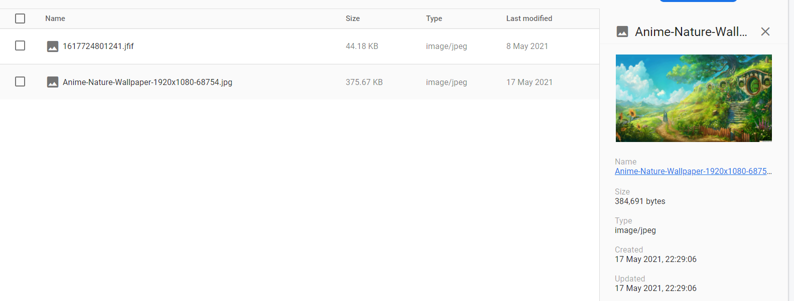
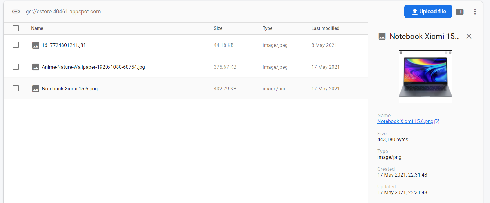

# eMarket
eMarket this is Android project with using Java / Firebase / Gradle and Some google services 

This application is a simple version of the project for me to learn to program for android. In this project the program which carries out basic tasks of shop is created.
____
!!!! Subtasks that were performed in the Application:
1) Create a registration form :white_check_mark:
2) Record in the database of registration information :white_check_mark:
3) Create an authorization form :white_check_mark:
4) Verification from the database of information for authentication :white_check_mark:
5) Creating a fragment with the main activity (Store goods they are static) :white_check_mark:
6) Creating product catalogs (Category) :white_check_mark:
7) Create a plus button to add an image of the future product, which is stored in the firebase :white_check_mark:

____
# :white_check_mark: Autorisation (Authorization)

____
# :white_check_mark: Registration 

____
# :white_check_mark: MainActivity (Fragment)

____
# :white_check_mark: Category

____
# :white_check_mark: Product Details

____
# :white_check_mark: Btn Plus 

____
# :white_check_mark: Add an image in the firebase

____
# :white_check_mark: Select images  

____
# :white_check_mark: Demonstrated saved Images #1

____
# :white_check_mark:  Demonstrated saved Images #2

____
